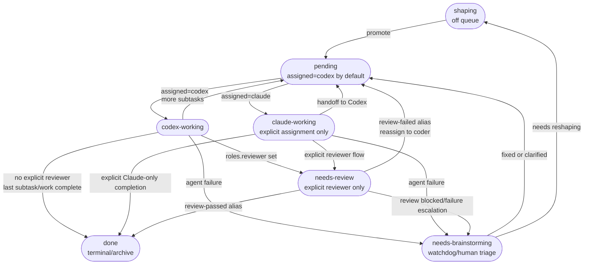

# Coord Architecture

End-to-end view of the shared Claude + Codex coordination system. Read this for the whole picture; follow the links for authoritative detail.

## What coord is

A file-based, two-agent work queue. Claude and Codex collaborate on tasks stored as Markdown files with YAML frontmatter. The shared `bin/coord` CLI is the only writer; a per-project launchd worker runs the assigned agent when work arrives.

Design goals:

- **No central server.** Tasks are plain files; git is the sync substrate.
- **Shared engine, per-project data.** One `coord/` checkout drives many project repos.
- **Additive schema.** Role-based fields layer on top of the original flow without migration.
- **Cheap idle.** Prechecks exit fast when no work exists; agents never spin.

## The three layers

| Layer | What it is | Authoritative detail |
|---|---|---|
| Task files | Markdown + YAML at `tasks/YYYY-MM-DD-<slug>.md` | [task-files.md](task-files.md) |
| `coord` CLI | The only writer — new, update, pickup, precheck, archive | [task-files-reference.md](task-files-reference.md) routing section |
| launchd loops | One plist per project; the worker dispatches to the assigned agent | [claude-coordination.md](claude-coordination.md), [codex-coordination.md](codex-coordination.md) |

Env wiring, repo layout, and the project/shared split: [coordination.md](coordination.md).

**Multi-project concurrency.** Each repo in `projects.txt` gets its own launchd worker — independent 60-second polls, queues, and logs — so all registered projects run in parallel. Actual agent executions are gated by a global N-slot semaphore (`worker/semaphore.sh`, default 5, `COORD_SEMAPHORE_N`): when all slots are busy a worker skips its tick and retries on the next one. Back-pressure, not queueing — nothing is lost, and one machine's CPU and provider quotas stay protected no matter how many projects are registered.

## Lifecycle

Full schema, role matrix, routing rules, end-to-end example: [task-files-reference.md](task-files-reference.md).

### Status state machine



Runnable statuses (worker picks up): `pending`, `needs-review`.
Terminal status: `done` — no outbound edges.
`needs-brainstorming` is the quarantine for tasks that need human or watchdog re-evaluation.

Common paths:

- **Default Codex path** — `shaping → pending/codex → codex-working → pending/codex` until subtasks are done, then `done`.
- **Explicit review** — `pending/codex → codex-working → needs-review/<reviewer> → done`.
- **Explicit architect handoff** — `pending/<architect> → *-working → pending/<coder>`, then the normal Codex or explicit-review path.
- **Recovery** — any failed or blocked working/review round can land in `needs-brainstorming`, then return to `pending` or `shaping`.

### Worker failure handling

When an agent exits non-zero, the worker runs the following recovery sequence:

```
rc != 0
    │
    ├─▶ rate-limit?  ──yes──▶  set sleep-until marker, exit (retry next tick)
    │
    ├─▶ save agent-runs JSON snapshot for post-mortem
    │
    ├─▶ detect Claude max-turns  (terminal_reason == "max_turns" or
    │       subtype == "error_max_turns"; Codex detection deferred)
    │
    ├─▶ commit_tentative_changes  (git add -A; commit as "coord: tentative …")
    │       └─▶ records whether a commit was made (TENTATIVE_COMMITTED)
    │
    ├─▶ capture TAIL  (last 40 lines of agent output)
    │
    ├─▶ reviewer APPROVE recovery  (runs before auto-requeue)
    │       if ROUND_ROLE == reviewer AND (TAIL or task body) contains APPROVE
    │           └─▶  coord update --status review-passed → done, exit 0
    │
    ├─▶ Claude max-turns auto-requeue  (if triggered above)
    │       ├─▶ read post-run state: CURRENT_STATUS, RETRIES_USED
    │       ├─▶ RETRIES_USED >= 1  ──▶  fall through to needs-brainstorming
    │       ├─▶ CURRENT_STATUS == done  ──▶  exit 0 (clean finish before rc)
    │       ├─▶ progress check:
    │       │       (a) TENTATIVE_COMMITTED == 1, OR
    │       │       (b) /tmp/claude-finding-<id>.txt exists, non-empty, mtime >= tick start, OR
    │       │       (c) git commit on task file with ct >= tick start + "claude-finding" in subject
    │       │   no progress  ──▶  fall through to needs-brainstorming
    │       └─▶ with progress:
    │               write max_turns = effective * 3, max_turns_retries_used = 1
    │               restore status = post-run pending/needs-review (preserve handoff)
    │                   or ORIG_STATUS from pickup packet as fallback
    │               coord update --force → exit 0  (task requeued at 3× budget)
    │               coord update failure  ──▶  fall through to needs-brainstorming
    │
    └─▶ needs-brainstorming  (all unrecovered failures land here)
            coord update --status needs-brainstorming --append-*-finding
            watchdog or human recovery → pending / shaping
```

`max_turns_retries_used` is the audit counter: absent = 0 retries used, 1 = cap reached. It is not reset on completion.

## Reasoning-effort and model selection

Full guidance, tables, and automation support: [task-files-reference.md](task-files-reference.md) role-based frontmatter fields section.

Short rule: keep the background loop at `medium`; raise individual tasks with `reasoning_effort: high|xhigh`; reserve `xhigh` for high-stakes work (money, auth, destructive migrations, RCA).

## Comparison to common multi-agent patterns

Compared with current mainstream agent frameworks, `coord` is intentionally conservative:

- **OpenAI Agents SDK:** coord supports both decentralized handoff and a manager-like architect step, but keeps orchestration in plain files instead of an always-live runtime. Tradeoff: less built-in tracing, much cheaper idle, easier human inspection.
- **Anthropic Claude Code subagents:** similar token benefits from role isolation and fresh sessions. Key difference: context is exchanged through task files instead of in-process subagent calls, so handoff payload size matters more.
- **LangGraph supervisor / AutoGen teams:** those systems share message context or broadcast team history. coord deliberately avoids shared transcript growth and keeps only explicit task state — better token control in long-lived coding workflows.

The main architectural lesson: **keep the state shared, not the transcript shared.**

## Conventions and invariants

- Never hand-edit task files — always go through `coord`
- Round-stamped findings: each agent appends under `### Round N`
- Content hashes guard against double-processing the same round
- Per-project isolation: trigger/cooldown/fail/block files are scoped by `COORD_PROJECT_LABEL`
- Single writer: only `coord` mutates task files; wrappers never edit directly

## Where to look next

- [coordination.md](coordination.md) — shared protocol: project-root commands, launchd env, mobile policy, output noise, transient limits
- [task-files.md](task-files.md) — task contract: format, statuses, read ladder (authoritative, always loaded)
- [task-files-reference.md](task-files-reference.md) — frontmatter fields, shaping bar, routing, lifecycle flows (on-demand)
- [claude-coordination.md](claude-coordination.md) — Claude-side trigger, model resolution, flow, task architecture
- [codex-coordination.md](codex-coordination.md) — Codex pickup model, watchdog, wrapper, observability
- `coord` source — authoritative when docs and code disagree
